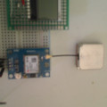

# rpi
My Arduino, ATTiny85, ESP8266/32, RPi (Raspberry Pi) and STM32 (blue pill) projects

## Arduino IDE

* [IDE](Arduino-IDE.md) : general setup, particularly about ATTiny85 setup.

## Boards

* [ATTiny85](attiny85)
* [ESP8266](esp8266)
* [GPIO-pi3](GPIO-pi3.md): pin diagram for RPi3.
* [nano](nano) - benchmarks, timer
* [stm8s103f3p6](stm8s103f3p6)
* [stm32](stm32) - blinker sketch
* [wroom](wroom)

## General

* [audio](audio)
* [circuits](circuits.md) - various electrical circuits
* [debounce](debounce) a button
* [serial](serial)
* [software](software.md)
* telnet server: [dev03-2](dev03/dev03-2)
* [Twiddle-factor FFT for mcus](https://blog.podkalicki.com/twiddle-factor-based-fft-for-microcontrollers/)

## Projects

* [0clock](0clock): nano, ds3231, zeroseg clock with timer
* [abaclock](abaclock): clock made with a RTC clock and an Arduino LED backpack
* [alacrity](alacrity): pills reminder and warnings raised by alarm
* [alarm](alarm): raises a panic call to alacrity
* [atlast](atlast): a Forth for mcus based on Walker's Forth
* blinky85: directory containing code for blinking an ATTiny85 from RPi - consider it a baseline for making projects using C++, and not the IDE
* [blinkt](blinkt)
* [crunky](crunky): start of a unikernel for Raspberry Pi 3
* [dev01](dev01): meditation timer
* [dev02](dev02): projects for the DEV02 home-made board: green_red and mhz85
* [dev03](dev03)
* [dev05](dev05): ATTiny85 programmer for the Pi
* [dev06](8x8/dev06): 8x8, nano
* [dev07](dev07): clock DS1307, MAX7219 8-segment display
* [dev08](dev08): 555 fixed tone generator
* [dev09](dev09): voltage generator. esp32 mcp4921 simplecli, timer interrupts
* [hertz](hertz): frequency measurement
* [minitone85](minitone85): working version of tone() for ATtiny85
* [mins30-85](mins30-85): 30 minute timer for ATTiny85, programmable from the Pi (`DEV01`). 
* [pills](pills): remember to take your pills
* [synth](synth): sound synthesizer/tone-maker
* [sleep85](sleep85): conserving power by putting the ATTiny85 to sleep

## Protocols

* [i2c](i2c): Arduino and RPi3 master, ATTiny85 slave
* [i2s](i2s)
* [spi](spi)

## Hardware

* [Enclosures](https://www.banggood.com/10pcs-75-x-54-x-27mm-DIY-Plastic-Project-Housing-Electronic-Junction-Case-Power-Supply-Box-p-1168741.html?cur_warehouse=CN) 10pcs 75 x 54 x 27mm DIY Plastic Project Housing Electronic Junction Case Power Supply Box 
* [Mini USB nano](https://www.ebay.co.uk/sch/i.html?_from=R40&_trksid=m570.l1313&_nkw=mini+usb+nano&_sacat=0). Amazon also has good deals on these
* [VGA breakout board](https://www.aliexpress.com/item/32601693326.html)
* [ZeroSeg](zeroseg) SPI

---
 [1306](1306) I2C. WROOM 
___

 [4](4) quasi-SPI. NANO/STM32/WROOM

___

 [8x8](8x8) I2C

---

 Stereo Audio Jack. G=GND, L=Left speaker, R=Right speaker, 1=unknown, 2=unknown.
Underside shown.

---

 [gps](gps)

---

 [mcp4921](mcp4921) 12-bit DAC. SPI

---

 [sdcard-spi](sdcard-spi)
