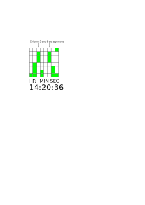

# abaclock

Abacus clock. You can see it in action in a YouTube [video](https://youtu.be/ezfyHekI0bc).

## Interpretting the matrix

Depending on how you orient the matrix, of course, the numbers are represented in columns. Columns 1 and 2 are for the hours, 4 and 5 are for the minutes, and 7 and 8 are for the seconds. Columns 3 and 6 are used to visually separate the compnents.

Numbers are repesented in "abacus form". A light at the top means "add 5" to the number of pips at the bottom of the column.

Example:

## Components

* Adafruit LED Backpack
* RTC Tiny clock

## Prerequisites

* Adafruit LED Backpack Library - install it from the Arduino IDE
* Adafruit GFX Library - also from the Arduino IDE
* RTC library

## Hookup

On both the RTC and Adafruit compnents, hook the VCC to 5V on the Arduino, GND, SDA and SCL pins to the Arduino. SDA is pin A4 on the Arduino, and SCL is pin A5.

## Code

Upload the INO file in the usual way

